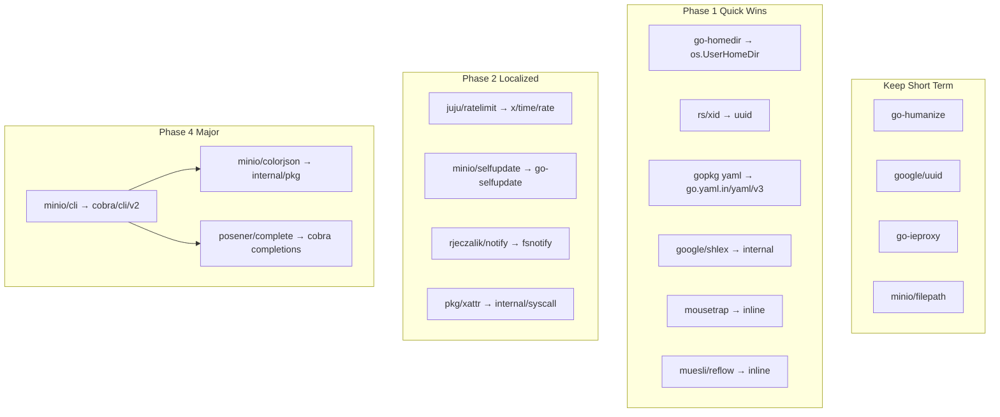

# Dependency Replacement Plan

This document plans how to address the 18 dependencies flagged as **abandoned** (no release within the configured `abandonmentThreshold`). The goal is to reduce unmaintained surface area without destabilizing `mc`.

**Scope note:** "Abandoned" here means release inactivity, not necessarily broken or unsafe. Several of these packages are stable, widely used, and unlikely to receive further releases because they are already feature-complete.

---

## Summary by Action

| Action | Count | Dependencies |
|--------|------:|--------------|
| **Keep (accept risk)** | 5 | `go-humanize`, `google/uuid`, `go-ieproxy`, `minio/filepath`, `minio/cli` (short term) |
| **Trivial / stdlib swap** | 3 | `go-homedir`, `rs/xid`, `gopkg.in/yaml.v3` |
| **Small inline or local copy** | 3 | `google/shlex`, `mousetrap`, `muesli/reflow` |
| **New dep + localized refactor** | 4 | `juju/ratelimit`, `minio/selfupdate`, `rjeczalik/notify`, `pkg/xattr` |
| **Large / cross-cutting refactor** | 3 | `minio/cli`, `minio/colorjson`, `posener/complete/v2` |
| **Test-only migration** | 1 | `gopkg.in/check.v1` |

---

## Recommended Phases

### Phase 1 — Quick wins (1–2 days, low risk)

Low blast radius; can land independently.

1. Replace `mitchellh/go-homedir` with `os.UserHomeDir()` in `cmd/config.go`.
2. Replace `rs/xid` with `google/uuid` (or stdlib) in `cmd/ilm/options.go` — one call site.
3. Switch `gopkg.in/yaml.v3` → `go.yaml.in/yaml/v3` in `cmd/admin-prometheus-generate.go` (already an indirect dep in `go.mod`).
4. Inline or vendor `google/shlex` (~single use in `cmd/find.go`).
5. Inline `inconshreveable/mousetrap` Windows guard (~15 lines in `cmd/main.go`).
6. Replace `muesli/reflow` wordwrap/truncate in `cmd/term-pager.go` and `cmd/trace-stats-ui.go` with small helpers or `lipgloss` width utilities already in use.

### Phase 2 — Localized refactors (1–2 weeks)

Contained changes; moderate test coverage needed.

7. Replace `juju/ratelimit` with `golang.org/x/time/rate` in `pkg/limiter/limiter.go`.
8. Replace `minio/selfupdate` with a maintained alternative (see below) in `cmd/update-main.go`.
9. Migrate `rjeczalik/notify` → `github.com/fsnotify/fsnotify` across `cmd/client-fs*.go` and `cmd/pipechan*.go` (fsnotify is already indirect).
10. Evaluate `pkg/xattr` replacement or internal syscall wrapper for Darwin/Linux/BSD xattr paths.

### Phase 3 — Test infrastructure (parallel track)

11. Migrate `gopkg.in/check.v1` suites in 6 test files to `testing` + `testify` (already a project dependency).

### Phase 4 — CLI stack (major project; defer unless committed)

12. Plan migration off `github.com/minio/cli` (~280 files) — likely to `spf13/cobra` or `urfave/cli/v2`.
13. Replace `github.com/minio/colorjson` (~120 files) — either as part of CLI migration or via a thin internal `pkg/colorjson` wrapper around `encoding/json` + terminal coloring.
14. Rebuild shell completion (`posener/complete/v2` in `cmd/auto-complete.go`) on top of the new CLI framework's completion APIs.

### Phase 5 — Accept-and-document

15. Document intentional retention of stable, low-risk packages (see "Keep" section below).

---

## Per-Dependency Plan

### 1. `github.com/dustin/go-humanize` — **Keep**

| | |
|---|---|
| **Last release** | 2023-01-10 |
| **Usage** | ~40+ files: `IBytes`, `Comma`, `RelTime`, `ParseBytes`, `Bytes`, `Time`, `MiByte`, etc. |
| **Recommendation** | **Keep** |

**Rationale:** Feature-complete formatting library with no known CVEs. Replacing it would touch a large portion of CLI output for negligible benefit. The project already wraps some duration formatting in `cmd/humanized-duration.go`; extending that pattern for bytes/counts would be a large, low-value rewrite.

**If forced to replace later:** Introduce a small internal `pkg/humanize` with only the ~8 functions actually used, backed by `golang.org/x/text` where applicable.

---

### 2. `github.com/google/shlex` — **Replace (easy)**

| | |
|---|---|
| **Last release** | 2019-12-02 |
| **Usage** | Single call: `shlex.Split(args)` in `cmd/find.go` |
| **Recommendation** | Copy into `internal/shlex` or use a maintained fork |

**Options (best first):**

1. **Vendor/copy** the ~120-line package into `internal/shlex` (Apache-2.0). Zero new deps.
2. Use `github.com/anmitsu/go-shlex` if a maintained external dep is preferred.

**Effort:** ~1 hour. **Risk:** Low — unit test the find `--exec` parsing path.

---

### 3. `github.com/google/uuid` — **Keep (short term)**

| | |
|---|---|
| **Last release** | 2024-01-23 |
| **Usage** | `cmd/client-fs.go` (`NewString`), `cmd/subnet-utils.go` (`Parse`, `Nil`), `cmd/suite_test.go` |
| **Recommendation** | **Keep** for now |

**Rationale:** De-facto standard UUID library; last release is recent. Go has no stdlib UUID package. Uses are straightforward v4 generation and parsing.

**Optional consolidation:** When removing `rs/xid`, standardize all ID generation on `google/uuid` rather than adding another ID library.

---

### 4. `github.com/inconshreveable/mousetrap` — **Replace (easy)**

| | |
|---|---|
| **Last release** | 2022-11-27 |
| **Usage** | Windows-only guard in `cmd/main.go`: `mousetrap.StartedByExplorer()` |
| **Recommendation** | Inline ~15 lines using `golang.org/x/sys/windows` or copy the single-file package |

**Effort:** ~30 minutes. **Risk:** Low — Windows-only UX path.

---

### 5. `github.com/juju/ratelimit` — **Replace (moderate)**

| | |
|---|---|
| **Last release** | 2019-10-02 |
| **Usage** | `pkg/limiter/limiter.go` — token-bucket upload/download throttling via `http.RoundTripper` |
| **Recommendation** | Migrate to `golang.org/x/time/rate` |

**Refactor sketch:**

```go
// Before: ratelimit.NewBucketWithRate + ratelimit.Reader
// After:  rate.NewLimiter(rate.Limit(n), burst) wrapping io.Reader per read
```

**Effort:** ~4 hours + integration tests for `--limit-upload` / `--limit-download` flags. **Risk:** Medium — verify byte-accurate throttling behavior.

---

### 6. `github.com/mattn/go-ieproxy` — **Keep**

| | |
|---|---|
| **Last release** | 2024-05-22 |
| **Usage** | `ieproxy.GetProxyFunc()` in `cmd/client-admin.go`, `cmd/utils.go` |
| **Recommendation** | **Keep** |

**Rationale:** Only reads Windows IE/Edge proxy registry settings. `golang.org/x/net/http/httpproxy` and stdlib `http.ProxyFromEnvironment` do **not** cover this. Last release is recent. Removing it breaks proxy auto-detection for many corporate Windows users.

---

### 7. `github.com/minio/cli` — **Keep short term; plan major migration**

| | |
|---|---|
| **Last release** | 2022-12-03 |
| **Usage** | Entire command tree (~280 files): `cli.Command`, `cli.Context`, `cli.Flag`, help templates |
| **Recommendation** | **Keep** until a dedicated CLI migration project; then move to `spf13/cobra` or `urfave/cli/v2` |

**Rationale:** This is architectural, not a dependency bump. The MinIO fork carries mc-specific behavior (`OnUsageError`, global flags, help templates). Replacing it touches every command file.

**Migration notes:**

- Map `cli.Command` → cobra.Command or urfave/cli/v2 Command.
- Preserve `--json` output paths and `OnUsageError` behavior.
- Expect 2–4 weeks of focused work with full integration test pass.
- Blocks/complicates `posener/complete` and `colorjson` migrations — do planning together.

**Effort:** **Large.** **Risk:** High if rushed.

---

### 8. `github.com/minio/colorjson` — **Replace (medium–large)**

| | |
|---|---|
| **Last release** | 2024-05-28 |
| **Usage** | ~120 files; imported as `json "github.com/minio/colorjson"` for colored `MarshalIndent` |
| **Recommendation** | Create internal `pkg/colorjson` or migrate to stdlib `encoding/json` + post-process coloring |

**Options:**

1. **Internal wrapper (preferred):** Copy/adapt minio/colorjson into `pkg/colorjson` under this repo's maintenance. API-compatible; mechanical import path change.
2. **Stdlib + coloring:** Use `encoding/json` and apply `fatih/color` / `console` colorization to output bytes. More invasive.

**Effort:** 1–3 days for option 1; longer for option 2. **Risk:** Medium — visual output regression in `--json` mode. Best done alongside or after CLI migration.

---

### 9. `github.com/minio/filepath` — **Keep**

| | |
|---|---|
| **Last release** | 2021-05-12 |
| **Usage** | `cmd/client-fs.go`: `xfilepath.Walk`, `xfilepath.ErrSkipDir` for wildcard-aware directory walks |
| **Recommendation** | **Keep**, or copy into `internal/filepath` if import hygiene matters |

**Rationale:** MinIO's fork extends stdlib `filepath` for flat-key / wildcard path matching used by `mc find` and FS mirror. Stdlib `filepath.WalkDir` does not provide equivalent semantics. The package is small and stable.

**If replacing:** Must reimplement `Walk` + `ErrSkipDir` with wildcard support — not worth it unless vendoring locally.

---

### 10. `github.com/minio/selfupdate` — **Replace (moderate)**

| | |
|---|---|
| **Last release** | 2022-10-19 |
| **Usage** | `cmd/update-main.go`: binary swap with SHA-256 checksum + optional minisign verification |
| **Recommendation** | Switch to `github.com/creativeprojects/go-selfupdate` or maintain a vendored fork |

**Migration checklist:**

- Map `selfupdate.Apply`, `selfupdate.Options`, `selfupdate.NewVerifier` to new API.
- Preserve minisign pubkey verification (`aead.dev/minisign` is already indirect).
- Preserve rollback behavior on failed update.
- Test on Linux, macOS, Windows with `--dry-run` where available.

**Effort:** ~1 day. **Risk:** Medium — binary update path must be tested on all release platforms.

---

### 11. `github.com/mitchellh/go-homedir` — **Replace (trivial)**

| | |
|---|---|
| **Last release** | 2019-01-27 |
| **Usage** | `homedir.Dir()` in `cmd/config.go` |
| **Recommendation** | Use `os.UserHomeDir()` (Go stdlib since 1.12) |

**Effort:** ~15 minutes. **Risk:** Very low. HashiCorp deprecated this package in favor of stdlib.

---

### 12. `github.com/muesli/reflow` — **Replace (easy)**

| | |
|---|---|
| **Last release** | 2021-05-17 |
| **Usage** | `wordwrap.String` in `cmd/term-pager.go`; `truncate.StringWithTail` in `cmd/trace-stats-ui.go` |
| **Recommendation** | Inline small helpers or use `github.com/muesli/termenv` / lipgloss width (already imported) |

**Effort:** ~2 hours. **Risk:** Low — UI wrapping only.

---

### 13. `github.com/pkg/xattr` — **Replace or keep (moderate)**

| | |
|---|---|
| **Last release** | 2020-06-30 |
| **Usage** | Extended attributes on FS client: `xattr.Get`, `xattr.List`, `xattr.Error` in `cmd/client-fs_{linux,darwin,freebsd,netbsd}.go` |
| **Recommendation** | Keep short term; migrate to `golang.org/x/sys/unix` xattr wrappers or `github.com/nightlyone/xattr` |

**Rationale:** xattr is inherently platform-specific; the current code already splits by OS build tags. A thin internal `pkg/xattr` using syscalls reduces external dependency without changing call sites much.

**Effort:** ~1–2 days including platform testing. **Risk:** Medium on Darwin/Linux/BSD only (Windows FS client doesn't use xattr).

---

### 14. `github.com/posener/complete/v2` — **Replace with CLI migration**

| | |
|---|---|
| **Last release** | 2023-07-19 |
| **Usage** | `cmd/auto-complete.go` (~686 lines), `cmd/main.go` (`completeinstall`) |
| **Recommendation** | Reimplement completions when migrating off `minio/cli` |

**Options after CLI migration:**

- **Cobra:** native `ValidArgsFunction` / `RegisterFlagCompletionFunc` + `cobra.GenBashCompletionV2`.
- **urfave/cli/v2:** built-in bash completion support.
- Keep generated completion scripts in `contrib/completions/` if shell-specific logic is needed.

**Effort:** **Large** (tied to Phase 4). **Risk:** Medium — completion regressions are user-visible but not data-loss risks.

---

### 15. `github.com/rjeczalik/notify` — **Replace (moderate)**

| | |
|---|---|
| **Last release** | 2023-01-12 |
| **Usage** | FS event watching for mirror/watch: `notify.Watch`, `notify.Stop`, event constants across `cmd/client-fs*.go`, `cmd/pipechan*.go` |
| **Recommendation** | Migrate to `github.com/fsnotify/fsnotify` |

**Refactor notes:**

- `notify.Event` bitmask constants differ from fsnotify; map per-OS event types in existing `client-fs_{linux,windows,darwin,...}.go` files.
- `notify.Watch(recursivePath, ch, events...)` → fsnotify watcher with recursive directory registration (may need helper; fsnotify is not recursive by default on all platforms).
- `pipechan_test.go` uses `notify.EventInfo` — update test types.

**Effort:** ~3–5 days. **Risk:** Medium–high — mirror/watch are core FS features; needs integration tests on Linux and macOS at minimum.

---

### 16. `github.com/rs/xid` — **Replace (trivial)**

| | |
|---|---|
| **Last release** | 2024-08-23 |
| **Usage** | Default ILM rule ID in `cmd/ilm/options.go`: `xid.New().String()` |
| **Recommendation** | Use `uuid.NewString()` (already a project dep) or `crypto/rand`-based ID |

**Effort:** ~15 minutes. **Risk:** Very low — only affects auto-generated ILM rule IDs (format changes from xid to UUID; acceptable).

---

### 17. `gopkg.in/check.v1` — **Replace (test-only, moderate)**

| | |
|---|---|
| **Last release** | 2020-11-30 |
| **Usage** | 6 test files: `cmd/client-fs_test.go`, `cmd/client-url_test.go`, `cmd/mc_test.go`, `cmd/client-s3_test.go`, `pkg/probe/probe_test.go`, `pkg/hookreader/hookreader_test.go`, `pkg/httptracer/httptracer_test.go` |
| **Recommendation** | Migrate to stdlib `testing` + `github.com/stretchr/testify` |

**Effort:** ~2–3 days. **Risk:** Low — test-only; no production impact.

---

### 18. `gopkg.in/yaml.v3` — **Replace (easy)**

| | |
|---|---|
| **Last release** | 2022-05-27 |
| **Usage** | `yaml.Marshal` in `cmd/admin-prometheus-generate.go` (2 call sites) |
| **Recommendation** | Switch import to `go.yaml.in/yaml/v3` |

**Rationale:** `go.yaml.in/yaml/v3` is the actively maintained continuation; already present as an indirect dependency. Drop-in API for `Marshal`.

**Effort:** ~30 minutes. **Risk:** Very low — verify `mc admin prometheus generate` output.

---

## Dependency Interaction Map



---

## Risk Matrix

| Dependency | User impact if broken | Migration risk | Priority |
|------------|----------------------|----------------|----------|
| `minio/cli` | Total CLI failure | High | Defer (plan only) |
| `rjeczalik/notify` | mirror/watch broken | Medium–High | Phase 2 |
| `minio/selfupdate` | `mc update` broken | Medium | Phase 2 |
| `juju/ratelimit` | bandwidth limits wrong | Medium | Phase 2 |
| `minio/colorjson` | `--json` colors wrong | Medium | Phase 4 |
| `posener/complete` | tab completion broken | Medium | Phase 4 |
| `pkg/xattr` | FS metadata on Unix | Medium | Phase 2 |
| `gopkg.in/check.v1` | tests fail | Low | Phase 3 |
| All Phase 1 items | Minimal | Low | **Do first** |

---

## Tracking

When a dependency is addressed, update this file:

- [x] Phase 1 complete
- [ ] Phase 2 complete
- [ ] Phase 3 complete
- [ ] Phase 4 scoped / scheduled
- [ ] "Keep" decisions reviewed annually

Consider adding a `gomodguard` or Renovate rule to block **new** imports of these abandoned packages while allowing existing ones until migrated.
