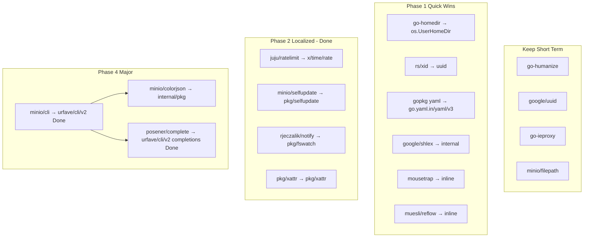

# Dependency Replacement Plan

This document plans how to address the 18 dependencies flagged as **abandoned** (no release within the configured `abandonmentThreshold`). The goal is to reduce unmaintained surface area without destabilizing `mc`.

**Scope note:** "Abandoned" here means release inactivity, not necessarily broken or unsafe. Several of these packages are stable, widely used, and unlikely to receive further releases because they are already feature-complete.

---

## Summary by Action

| Action | Count | Status | Dependencies |
|--------|------:|--------|--------------|
| **Keep (accept risk)** | 4 | Open | `go-humanize`, `google/uuid`, `go-ieproxy`, `minio/filepath` |
| **Trivial / stdlib swap** | 3 | **Done** | `go-homedir`, `rs/xid`, `gopkg.in/yaml.v3` |
| **Small inline or local copy** | 3 | **Done** | `google/shlex`, `mousetrap`, `muesli/reflow` |
| **New dep + localized refactor** | 4 | **Done** | `juju/ratelimit`, `minio/selfupdate`, `rjeczalik/notify`, `pkg/xattr` |
| **Large / cross-cutting refactor** | 3 | Partial | `minio/cli` **Done**, `minio/colorjson` open, `posener/complete/v2` **Done** |
| **Test-only migration** | 1 | **Done** | `gopkg.in/check.v1` |

**Progress:** 13 of 18 dependencies addressed on `replace_deps` (removed from direct `go.mod` or vendored in-tree). 5 remain as direct dependencies.

---

## Recommended Phases

### Phase 1 — Quick wins ✅ complete

- [x] `go-homedir` → `os.UserHomeDir()` in `cmd/config.go`
- [x] `rs/xid` → `google/uuid` in `cmd/ilm/options.go`
- [x] `gopkg.in/yaml.v3` → `go.yaml.in/yaml/v3` in `cmd/admin-prometheus-generate.go`
- [x] `google/shlex` → `pkg/shlex`
- [x] `mousetrap` → inline Windows guard in `cmd/explorer_*.go`
- [x] `muesli/reflow` → `pkg/textutil`

### Phase 2 — Localized refactors ✅ complete

- [x] `juju/ratelimit` → `golang.org/x/time/rate` in `pkg/limiter/limiter.go`
- [x] `minio/selfupdate` → `pkg/selfupdate` (vendored in-tree)
- [x] `rjeczalik/notify` → `pkg/fswatch` (vendored in-tree; not `fsnotify`, for behavioral parity)
- [x] `pkg/xattr` → `pkg/xattr` (vendored in-tree)

### Phase 3 — Test infrastructure ✅ complete

- [x] `gopkg.in/check.v1` → stdlib `testing` + `github.com/stretchr/testify` (7 test files)

### Phase 4 — CLI stack (partial)

- [x] `minio/cli` → `urfave/cli/v2` (~294 cmd files)
- [ ] `minio/colorjson` → internal `pkg/colorjson` or stdlib `encoding/json` + coloring (~120 files)
- [x] `posener/complete/v2` → `urfave/cli/v2` shell completion APIs

### Phase 5 — Accept-and-document

- [x] Document intentional retention of stable, low-risk packages (see checklist below)
- [ ] Review "Keep" decisions annually

---

## Per-Dependency Plan

Checklist grouped by recommended action. **13 of 18 done** on `replace_deps`; remaining items are either intentional keeps or Phase 4 work.

Legend: ✅ removed/replaced (no longer a direct `go.mod` dep) · ⏳ still a direct dep · 📦 vendored in-tree

### Keep (accept risk) — 4 open

Intentionally retain; review annually or revisit only if a security issue emerges.

- [ ] ⏳ `github.com/dustin/go-humanize` — formatting helpers in ~40+ files; feature-complete
- [ ] ⏳ `github.com/google/uuid` — ID generation/parsing; de-facto standard, no stdlib alternative
- [ ] ⏳ `github.com/mattn/go-ieproxy` — Windows IE/Edge proxy auto-detection
- [ ] ⏳ `github.com/minio/filepath` — wildcard-aware `Walk` / `ErrSkipDir` for FS find and mirror

### Trivial / stdlib swap — 3 done

- [x] ✅ `github.com/mitchellh/go-homedir` → `os.UserHomeDir()` (`cmd/config.go`)
- [x] ✅ `github.com/rs/xid` → `google/uuid` (`cmd/ilm/options.go`)
- [x] ✅ `gopkg.in/yaml.v3` → `go.yaml.in/yaml/v3` (`cmd/admin-prometheus-generate.go`)

### Small inline or local copy — 3 done

- [x] 📦 `github.com/google/shlex` → `pkg/shlex`
- [x] ✅ `github.com/inconshreveable/mousetrap` → `cmd/explorer_windows.go` / `cmd/explorer_other.go`
- [x] 📦 `github.com/muesli/reflow` → `pkg/textutil`

### New dep + localized refactor — 4 done

- [x] ✅ `github.com/juju/ratelimit` → `golang.org/x/time/rate` (`pkg/limiter/limiter.go`)
- [x] 📦 `github.com/minio/selfupdate` → `pkg/selfupdate` (minisign verification preserved)
- [x] 📦 `github.com/rjeczalik/notify` → `pkg/fswatch` (vendored for mirror/watch parity)
- [x] 📦 `github.com/pkg/xattr` → `pkg/xattr` (Darwin/Linux/BSD extended attributes)

### Large / cross-cutting refactor — 1 done, 2 open

- [x] ✅ `github.com/minio/cli` → `urfave/cli/v2` (~294 cmd files)
- [ ] ⏳ `github.com/minio/colorjson` → internal `pkg/colorjson` or stdlib + coloring (~120 files)
- [x] ✅ `github.com/posener/complete/v2` → `urfave/cli/v2` shell completion (`cmd/auto-complete.go`)

### Test-only migration — 1 done

- [x] ✅ `gopkg.in/check.v1` → stdlib `testing` + `github.com/stretchr/testify` (7 test files)

**Notes:**

- Some replaced packages may still appear in `go.sum` as **indirect** transitive dependencies (e.g. `gopkg.in/check.v1` via `madmin-go`).
- New direct dependencies added during migration: `go.yaml.in/yaml/v3`, `golang.org/x/time`, `aead.dev/minisign`, `github.com/stretchr/testify`, `github.com/mattn/go-runewidth`, `github.com/urfave/cli/v2`.

---

## Dependency Interaction Map

---

## Risk Matrix

| Dependency | User impact if broken | Migration risk | Status |
|------------|----------------------|----------------|--------|
| `minio/cli` | Total CLI failure | High | **Done** → `urfave/cli/v2` |
| `minio/colorjson` | `--json` colors wrong | Medium | Open (Phase 4) |
| `posener/complete` | tab completion broken | Medium | **Done** → `urfave/cli/v2` |
| `go-humanize` | formatted output wrong | Low | Keep |
| `google/uuid` | ID generation fails | Low | Keep |
| `go-ieproxy` | Windows proxy detection | Low | Keep |
| `minio/filepath` | FS find/mirror walks | Low | Keep |
| `rjeczalik/notify` | mirror/watch broken | Medium–High | **Done** → `pkg/fswatch` |
| `minio/selfupdate` | `mc update` broken | Medium | **Done** → `pkg/selfupdate` |
| `juju/ratelimit` | bandwidth limits wrong | Medium | **Done** → `x/time/rate` |
| `pkg/xattr` | FS metadata on Unix | Medium | **Done** → `pkg/xattr` |
| `gopkg.in/check.v1` | tests fail | Low | **Done** → testify |
| All Phase 1 items | Minimal | Low | **Done** |

---

## Tracking

When a dependency is addressed, update this file:

- [x] Phase 1 complete
- [x] Phase 2 complete
- [x] Phase 3 complete
- [x] Phase 5 documented (keep decisions in checklist above)
- [x] Phase 4 `minio/cli` → `urfave/cli/v2`
- [ ] Phase 4 remaining (`minio/colorjson`)
- [ ] "Keep" decisions reviewed annually

Consider adding a `gomodguard` or Renovate rule to block **new** imports of these abandoned packages while allowing existing ones until migrated.
